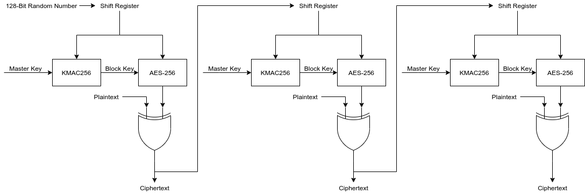

# Crypto Voice Transceiver On A Raspberry Pi #

This document provides an overview of the Crypto Voice Transceiver project as
well as a brief theory of operations and instructions for how to build one
using the provided software builds

## What Is It? ##

The Crypto Voice Transceiver is a system for implementing
[Secure Voice](https://en.wikipedia.org/wiki/Secure_voice). The system digitizes
voice input using a low-bitrate voice encoder
([Codec 2](http://www.rowetel.com/wordpress/?page_id=452)) in this case,
encrypts the digital voice signal, and transmits it in a way that allows it to
be transferred over a standard analog voice radio signal such as a narrowband
FM voice radio or analog telephone.

Conceptually the device is similar to military voice encryption terminals like
the [KY-99](https://www.cryptomuseum.com/crypto/usa/ky99/index.htm) or
[Securenet](https://www.cryptomuseum.com/crypto/motorola/saber/index.htm#algo)
modules from Motorola. On one end of the device the user plugs in a headset,
and on the other end the user connects the device to a radio or analog phone.
The user then uses the radio or phone as they usually would, except the sound
is being digitized and encrypted by the Crypto Voice Transceiver.

## How Does It Work? ##

The analog voice is first digitized then sent to a voice encoder or vocoder.
A vocoder is an audio compression system optimized for compressing voice so it
is understandable even at extremely low bitrates. A typical song is encoded at
somewhere between 128-328 kbits/second, while a typical vocoder is able to
produce voice down to 1.2-1.6 kbits/second, with some systems able to work at
even lower bit rates.

The Crypto Voice Transceiver uses the
open source [Codec 2](http://www.rowetel.com/wordpress/?page_id=452) vocoder
running in the 1.6 kbits/second mode. This vocder operates on audio blocks 40 ms
in duration and is able to represent that 40 ms block in 52 bits.

Once a 52 bit block of compressed audio is produced, it is encrypted using an
AES-256 cipher in a cipher feedback mode. This allows a receiver to
self-synchronize with a transmitter if a block is lost. A diagram of encryption
is shown below.

After a transmission completes and after every minute of silence, a new randomly
generated initialization vector obtained from the random number generator. This
initialization vector is fed into a KMAC-256 keyed hash algorithm along with a
1048 bit shared key embedded into the Crypto Voice Transceiver. This generates
a new 256-bit AES key for each block. This key along with the initialization
vector is fed into the AES cipher and produces a stream key which is then XOR-ed
with the 52-bit compressed voice block to obtain a 52-bit ciphertext block. 48
of these 52 bits are then copied into a shift register which is used as the
initialization vector for encrypting the next block.

Decryption operates the same way, but in reverse. Whenever a new initialization
vector is produced there is some loss of data as the receiver resynchronizes,
but resynchronization can complete within 4 blocks, or 160 ms.

Once the encrypted block is produced, it is transmitted using an audio frequency
shift keying modulator. This is a standard means of transmitting digital data
at low bit rates over analog mediums intended to transfer voice. This is how
the original [acoustic coupler](https://en.wikipedia.org/wiki/Acoustic_coupler)
modems used to transfer data over phone lines.

## How Do You Build One? ##

At a minimum, you will need the following:

* 1 Raspberry Pi 3 Model B+
* 1 Raspberry Pi Power Supply
* 2 USB audio receivers (I used
  [these](https://www.amazon.com/MillSO-Sapphire-External-Headphone-Desktops/dp/B0827XDGV4),
  but anything that says it supports the USB Audio Device Class should work)
* 1 SD card, minimum 64 MB (*not* GB)

### A Brief Note on USB Audio Receivers ###

Select a product that is convenient for your use case. For example, I selected
a product that has a short TRRS audio cable built into it like this:

I selected a product with TRRS (instead of separate speaker/microphone
connectors) because both my headset and radio cable used TRRS connectors. If
you don't, find a one that has separate speaker/microphone connectors.

I selected a product with the built-in audio cable because I plan to put my
completed built in an enclosure, and the built-in cables mean I don't need to
buy extension cables to route the audio jacks out the enclosure.

One thing to be cautious of is some of the devices are rather large, and the
USB connectors on the PI are spaced rather close together. Whatever you buy,
make sure you can actually plug two of them in at the same time.

### Optional Components ###

More advanced builds may involve additional components to make the design more
polished or portable, such as

* USB phone charger instead of a power supply (get one as close to 2.5A output
  as possible)
* Micro USB power switch cable to allow power to be disconnected without
  unplugging USB connectors
* SD card extenders to make it easier to insert/remove the SD card
* Enclosure to contain the build

Note that the system works *very* well using phone charger battery instead of a
power supply. I ran a simple "loopback" test with the device connected to an
8000 mAH battery, and it remained operational for almost 13 hours. The software
does not require a lot of power, and this design is well-suited to portable
applications

If you decide to put it in an enclosure, it is recommended that you do *not* do
so until you go through the programming and configuration process.

## Programming ##

1. Download the sdcard.img.zip
   [release](https://github.com/aarmono/crypto_transceiver_buildroot/releases).
   This is a heavily customized version of the Linux software that normally runs
   on a Raspberry Pi and will *not* run anything else but the barebones software
   necessary to run the crypto_transceiver software. *Note:* you only need to
   flash the SD card once. For subsequent firmware updates you only need to
   download the zImage file
1. Unzip the sdcard.img.zip. You should then have a file named sdcard.img
1. Follow the [instructions](https://www.raspberrypi.org/documentation/installation/installing-images/)
   on the Raspberry Pi site for flashing an image to the SD card.

## Generatng and Saving a Key ##

1. Download the Crypto Transceiver Config
   [Utility](https://github.com/aarmono/CryptoTransceiverUtil/releases). This
   will allow you to generate an encryption key and load it onto the SD card or
   update firmware versions when there are updated versions of firmware
1. Run the Crypto Transciever Config Utility
1. Click "New Key" . You should see text in the
   "Key Hash" textbox. Note this is *not* the key itself but merely a way you
   can visually distinguish whether or not two SD cards are programmed with
   the same key
1. Click "Save Key to SD" 
1. In the dialog box that appears, select the SD card you wish to write to.
   
1. Click "OK"

## Loading an Existing Key ##

You may wish to program an SD card using an existing key. To do so.

1. Run the Crypto Transceiver Config Utility
1. Click the "Read Key From SD" button.
1. In the dialog box that appears, select the SD card you wish to read from
1. Click "OK". The text in the "Key Hash" textbox should be updated.

This key can now be saved to an SD card as usual. This does not require the
original SD card still be plugged into the computer.

## First Time Boot ##

There still likely will need to be some configuration which needs to be
performed on the device the first time it is powered on, such as adjusting
microphone and speaker volume settings on both audio devices. To do this,
ensure a programmed SD card with key is installed in the Raspberry Pi, both
audio devices are plugged into their own USB ports, and that a monitor is
connected to the Raspberry Pi through the HDMI connector. A keyboard will also
need to be connected, but it is recommended that this be done after the system
boots up, as the keyboard may affect the order in which USB devices are
initialized during start-up.

Power on the device. After a few seconds, the boot process should complete; and
you should hear what sounds like noise coming out of one of the audio devices.
This is the side that will be connected to your radio or phone. The other device
will be connected to your headset.

A prompt should appear on the screen telling you to select one of the audio
devices or "save". To perform this part of the setup process it is important
to have some way of checking voice levels. One way to do this is to connect
the radio output to the radio input using a male-male
cable. This will verify that the levels on the radio side are adequate to
decode the signal as well as provide you with voice feedback you can use to
adjust the headset levels.

Once you do this, select each device. A user interface will be displayed on the
screen that will allow you to adjust levels of each audio device. The left/right
arrow keys will allow you to cycle through settings, and the up/down arrow keys
will allow you to adjust volume settings. Once you are done, the Escape key will
exit out of the UI. Once you have adjusted both interfaces, follow the commands
on the screen to save the settings to the SD card. They will be loaded from the
SD card whenever the system is powered on.
