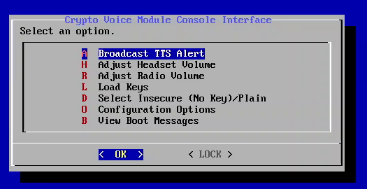
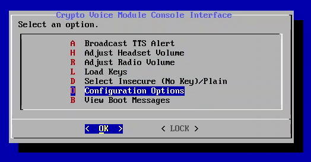
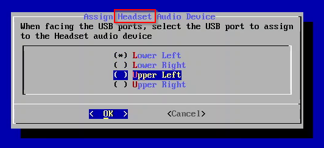
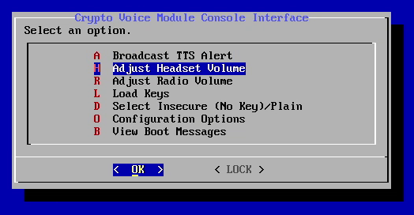
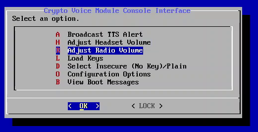
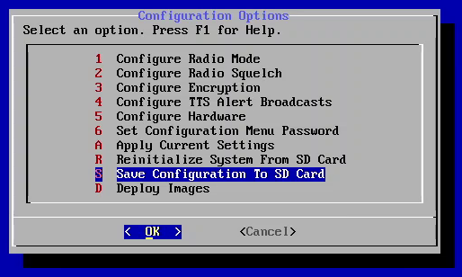
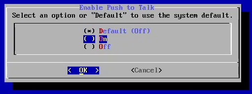

# Encrypted Digital Voice On A Raspberry Pi #

This document provides an overview of the Crypto Voice Module project as
well as a brief theory of operations and instructions for how to build one
using the provided software builds

## What Is It? ##

The Crypto Voice Module is a system for implementing
[Secure Voice](https://en.wikipedia.org/wiki/Secure_voice). The system digitizes
voice input using a low-bitrate voice encoder
([Codec 2](http://www.rowetel.com/wordpress/?page_id=452)) in this case,
encrypts the digital voice signal, and transmits it in a way that allows it to
be transferred over a standard analog voice radio signal such as a narrowband
FM voice radio, single-sideband radio, or analog telephone.

Conceptually the device is similar to military voice encryption terminals like
the [KY-99](https://www.cryptomuseum.com/crypto/usa/ky99/index.htm) or
commercial versions like the
[Securenet](https://www.cryptomuseum.com/crypto/motorola/saber/index.htm#algo)
modules from Motorola. On one end of the device the user plugs in a headset,
and on the other end the user connects the device to a radio or analog phone.
The user then uses the radio or phone as they usually would, except the sound
is being digitized and encrypted by the Crypto Voice Module.

## How Does It Work? ##

The analog voice is first digitized then sent to a voice encoder or vocoder.
A vocoder is an audio compression system optimized for compressing voice so it
is understandable even at extremely low bitrates. A typical song is encoded at
somewhere between 128-328 kbits/second, while a typical vocoder is able to
produce voice down to 1.2-1.6 kbits/second, with some systems able to work at
even lower bit rates.

The Crypto Voice Module uses the
open source [Codec 2](http://www.rowetel.com/wordpress/?page_id=452) vocoder
running in the 1.6 kbits/second mode. This vocder operates on audio blocks
40 ms in duration and is able to represent that 40 ms block in 52 bits.

Once a 52 bit block of compressed audio is produced, it is encrypted using an AES-256
cipher in a cipher feedback mode. This allows a receiver to self-synchronize
with a transmitter if a block is lost. A diagram of encryption is shown below.

After a transmission completes or every 5 minutes, a new randomly generated
128-bit initialization vector is obtained from the random number generator.
This initialization vector is fed into a KMAC-256 keyed hash algorithm along
with a 1048 bit shared key embedded into the Crypto Voice Module. This generates
a new 256-bit AES key for each block. This key along with the initialization
vector is fed into the AES cipher and produces a stream key which is then XOR-ed
with the 52-bit compressed voice block to obtain a 52-bit ciphertext block.
48 of these 52 bits are then copied into a 128-bit shift register which is used
as the initialization vector for encrypting the next block.

Decryption operates the same way, but in reverse. Whenever a new initialization
vector is produced there is some loss of data as the receiver resynchronizes,
but resynchronization can complete within 4 blocks, or 160 ms.

Once the encrypted block is produced, it is transmitted using an audio frequency
shift keying modulator. This is a standard means of transmitting digital data
at low bit rates over analog mediums intended to transfer voice. This is how
the original [acoustic coupler](https://en.wikipedia.org/wiki/Acoustic_coupler)
modems used to transfer data over phone lines worked. The low data rate required
of the vocoder and slow data rate of the frequency shift keying modulator allows
the encrypted digital voice signal to be transmitted over a standard narrowband
FM radio channel.

## How Do You Build One? ##

At a minimum, you will need the following:

* 1 Raspberry Pi 3 Model B+ ~~or Raspberry Pi Zero~~ (I no longer recommend the
  Raspberry Pi Zero due to issues getting the USB audio devices to work reliably
  through the necessary USB hub) 
* ~~1 USB OTG Hub (if using a Raspberry Pi Zero)~~
* 1 Raspberry Pi Power Supply
* 2 USB audio receivers (I used
  [these](https://www.amazon.com/MillSO-Sapphire-External-Headphone-Desktops/dp/B0827XDGV4),
  but anything that says it supports the USB Audio Device Class should work)
* 1 SD card, minimum 64 MB (*not* GB)

### A Brief Note on USB Audio Receivers ###

Select a product that is convenient for your use case. For example, I selected
a product that has a short TRRS audio cable built into it like this:

I selected a product with TRRS (instead of separate speaker/microphone
connectors) because both my headset and radio cable used TRRS connectors. If
you don't, find a one that has separate speaker/microphone connectors.

I selected a product with the built-in audio cable because I originally planed
to put my completed built in an enclosure, and the built-in cables mean I don't
need to buy extension cables to route the audio jacks out the enclosure.

One thing to be cautious of is some of the devices are rather large, and the
USB connectors on the PI are spaced rather close together. Whatever you buy,
make sure you can actually plug two of them in at the same time.

### Optional Components ###

More advanced builds may involve additional components to make the design more
polished or portable, such as

* USB phone charger instead of a power supply (get one that has at least one
  port that outputs as close to 2.5A output as possible)
* Micro USB power switch cable to allow power to be disconnected without
  unplugging USB connectors
* SD card extenders to make it easier to insert/remove the SD card
* Enclosure to contain the build

Note that the system works *very* well using phone charger battery instead of a
power supply. I ran a simple "loopback" test with the device connected to an
8000 mAH battery, and it remained operational for almost 13 hours. The software
does not require a lot of power, and this design is well-suited to portable
applications.

If you decide to put it in an enclosure, it is recommended that you do *not* do
so until you go through the programming and configuration process.

## An Example Build ##

This section shows an example build that the author made. With some slight
modification this build could be put into an enclosure for improved portability.

* 1 [Raspberry Pi Model 3 B+ with enclosure and heatsinks.](https://www.amazon.com/gp/product/B01C6EQNNK/).
  You do not need the power supply. If you put the build in an enclosure you do
  not need an enclosure for the Pi.
* 1 Cell phone battery charger (I used a spare one I had). See above sections
  for power supply requirements. If you wish to attach the power button to the
  side of the battery you will need a reasonably thick battery
* 2 [MISO USB Audio devices](https://www.amazon.com/gp/product/B0828J36JD/)
* 1 [Micro USB Power Switch cable](https://www.amazon.com/gp/product/B018BFWLRU/)
* 1 [Micro SD Extension Cable](https://www.amazon.com/gp/product/B085HGTJWT/).
  This makes it easier to access the SD card when the Pi is mounted to the
  battery pack
* 1 SD Card. Likely any SD Card you have will work
* 1 Short Micro USB Cable

### Build Procedure ###

1) Follow the instructions that came with the Pi to install the heatsinks and
   install the Pi into its case
1) Insert the SD Extension Cable into the Pi's SD card slot
1) Use hot glue or heavy duty double-sided tape to attach the SD Extension Cable
   to the top of the Pi enclosure. If the ribbon cable is too long, fold the
   ribbon cable in place using a dab of hot glue
1) Install the USB Audio devices into the bottom USB ports of the Pi
1) Use hot glue or heavy duty double-sided tape to attach the Pi to the top of
   the battery pack. If there are charge indicator lights or power buttons, try
   not to obstruct them
1) Plug the Micro USB Cable into the Micro USB Power Switch. Plug the Male side
   of the Micro USB Power Switch into the Pi's Power port.
1) Route the Micro USB Power Switch cable under the USB Audio devices so that
   they are wedged between the battery pack and the USB Audio device dongles.
   Hot glue the cable to the battery pack and USB Audio devices to to prevent
   them from being bent or damaged, taking care that the USB cable is not
   pushing them above horizontal.
   
   
1) Use heavy duty double-sided tape or hot glue to attach the power switch to
   the side of the battery
1) Hot glue the audio connectors from the USB Audio devices to the sides of the
   Pi enclosure. As cables will be plugged and unplugged into these connectors,
   ensure you use plenty of glue to hold the connectors firmly in place
1) Plug the USB A side of the cable into the highest power outlet of the battery
   pack
1) Label the USB Audio Devices once you have gone through the configuration
   process and know which one is the headset device and which is the radio
   device

## Programming ##

1. Download the release_raspberrpi.zip
   [release](https://github.com/aarmono/crypto_transceiver_buildroot/releases)
   for your model of Raspberry Pi. This is a heavily customized version of the
   Linux software that normally runs on a Raspberry Pi and will *not* run
   anything else but the barebones software necessary to run the
   crypto_transceiver software. *Note:* you only need to flash the SD card once.
   For subsequent firmware updates you only need to use the zImage file
1. Unzip the release_raspberrypi.zip. You should then have a file named sdcard.img
1. I recommend using [balenaEtcher](https://etcher.balena.io/) to flash the image
   onto the SD Card. Install the software and follow the prompts, selecting the
   sdcard.img file when asked to supply an image to write to the SD Card.

## Generatng and Saving a Key ##

1. Connect a keyboard and display to the Rapsberry Pi
1. Navigate to "Configuration Options" -> "Configure Encryption"
1. Select "Generate Encryption Keys"
1. Generate as many keys as desired, then press Enter
1. Navigate to "Deploy Images" -> "Keys Only"
1. Follow the on-screen prompts. This will format your SD Card
   or USB Drive with an image containing the keys

## Loading an Existing Key ##

You may wish to program an SD card using an existing key. To do so.

1. Connect a keyboard and display to the Raspberry Pi
1. Select "Load Keys"
1. Navigate to "Configuration Options" -> "Deploy Images" -> "Keys Only"
1. Follow the on-screen prompts. This will format your SD Card
   or USB Drive with an image containing the keys.

## First Time Boot ##

There still will need to be some configuration which needs to be performed
on the device the first time it is powered on. To do this, ensure a programmed
SD card with key is installed in the Raspberry Pi, both audio devices are plugged
into their own USB ports, a monitor is connected to the Raspberry Pi through the
HDMI connector, and a keyboard is connected to a USB port.

Power on the device. After a few seconds, the boot process should complete; and
you should see a configuration interface displayed on your screen.

You will first need to assign each USB audio device as either the Headset device
or the Radio device. To do this:

1. Highlight "Configuration Options" and press Enter

   
1. Highlight "Configure Hardware" and press Enter

   
1. Highlight "Assign Audio Devices" and press Enter

   
1. While facing the USB ports of the Pi, use the arrow keys to select which port
   the audio device you wish to use for the Headset is connected to.

   
1. Confirm your choice by pressing Spacebar. The selection should now have a star
   next to it. Then press Enter

   
1. Use the arow keys to select which port the audio device you wish to use for the
   Radio is connected to.

   
1. Confirm your choice by pressing Spacebar. The selection should now have a star
   next to it. Then press Enter.

   

Next you will need to adjust the audio settings for the Headset and Radio devices.
To do this:

1. Highlight "Adjust Headset Volume" and press Enter. A configuration screen will
   appear.
   
   
1. The following are the configuration settings I use. Navigate between settings
   by pressing the Left and Right arrow keys. The "Mic" setting that is set to
   0 appears to be some sort of sidetone, so I always turn it off. Auto Gain
   Control can be toggled by highlighting it with the arrow keys and pressing "m".
   Additional help is available by pressing F1
   
   
1. When the settings are set as desired, press Escape to exit
1. Highlight "Adjust Radio Volume" and press Enter. A configuration screen will
   appear.

   
1. The following are the configuration settings I use. Navigate between settings
   by pressing the Left and Right arrow keys. As above, I turn off the sidetone.
   It is also important on the Radio device that Auto Gain Control be turned Off.
   If the settings are too high the signal can become clipped/distorted.

   
1. When the settings are set as desired, press Escape to exit

If you have not already done so, create an encryption key by following the
"Generating and Saving a Key" step above. You can also adjust other settings
as desired. When you have finished, select "Save Current Settings to SD Card".

If this is successful, you should see a messsage to that effect.

## Device Deployment ##

The Console Interface has capabilities for creating duplicate SD Cards with
the same hardware, firmware, and radio configuration, in scenarios where
multiple devices will be deployed to the field. These devices are "locked",
meaning the user is prevented from making changes to the configuration or
(optionally) accessing the Console Interface at all.

1. Highlight "Configuration Options" and press Enter

   
1. Highlight "Deploy Images" and press Enter

   
1. You will see a number of options for images to deploy onto an SD Card
   or USB Drive. "Locked Device" images are written so that the user cannot
   change system configuration, and the SD Card is then permanently made
   read-only to prevent tampering. "Handheld" images additionally lock
   the display entirely so it cannot be used and is recommended when
   deploying devices which will not use the screen.

   "Keys Only" images will write just the encryption keys to either an SD
   Card or USB Drive. These cards/drives are not write-protected after the
   process completes, and it is recommended that after keys are loaded onto
   devices the media used for key storage be destroyed or (if the storage
   media supports it) securely erased.

   
1. Once an option is selected, you will be prompted to insert storage media.
   Locked Device images can only be written to SD Cards.

   
   
   Keys can be written to either an SD Card or a USB Drive. If both a USB Drive
   and SD Card is installed in the system, the USB Drive will be used. Select
   "Yes" once you have done so to start the process.

   
1. Once you have selected "Yes", the image writing process will start. At the
   end you should see a message that says "Success".

   
1. Once you see "Success", if you do not wish to write protect the SD Card you
   can remove it. If the SD Card is installed in the system once you press "OK",
   it will be write-protected. You will see one of three messaages:

   * "Write Protect Succeeded": The write protection process completed successfully,
     and the data on the SD Card can no longer be modified.
   * "Could Not Write Protect": The SD Card does not support write protection, and
     the card is *not* write protected.
   * "Write Protect Doesn't Work": The SD Card claimed to write protect the drive,
     but the software was still able to made changes to it.
1. Once you have selected "OK" you will be prompted to insert another storage media
   or stop the deployment process.

   

## Advanced Configuration ##

Some functions can be performed using buttons connected to the Pi GPIO header:

* Headset volume
* Plain/Secure toggle
* Key Load
* Key Select
* Push to Talk

The default pin assignments are listed in the diagram above. All input pins
default to Active Low with the internal pull-up resistor enabled. All output
pins default to Active Low, open drain.

### Configure Push To Talk ###

Push to Talk is the only I/O that needs to be enabled. 

1. Highlight "Configuration Options" and press Enter

   
1. Highlight "Configure Hardware" and press Enter

   
1. Highlight "Configure PTT GPIO" and press Enter

   
1. Highlight "Enable PTT" and press Enter

   
1. Use the arow keys to select "On"

   
1. Confirm your choice by pressing Spacebar. The selection should now have a
   star next to it. Then press Enter

   

## Using The Keypad ##

This section describes how to use external buttons connected to the GPIO header
(the "keypad") to accomplish certain tasks.

The keypad has two multi-function "action" buttons: the "primary" action button
and the "secondary" action button. A triple-press of either action button will
activate the primary TTS alert broadcast or the secondary TTS alert broadcast.

### Key Select ###

Follow the steps below to use the "Key Select" feature.

1. Press and hold the primary action button. You will hear "Key Select" over
   the headset
1. With the primary action button held down, press and hold the secondary
   action button. You will hear the index of the key currently in use.
1. With the primary action button held down, release the secondary action
   to go the next key slot index with a key.
1. With the primary action button held down, press and hold the secondary
   action button. You will hear the index of the currently selected key.
1. Continue this press and release until you hear the index of the key you
   wish to use.
1. With both the primary and secondary action buttons held down, release the
   primary action button to update the key currently in use. You will hear
   a confirmation notification over the headset.
1. Release the secondary action button.

While the primary action button is held down and the secondary action button is
released, release the primary action button to cancel the key selection process.

### Key Load ###

The Key Load feature will load keys into the device under the following conditions:

* Keys have not already been loaded into the device
* There is a USB drive or SD card containing keys installed in the device

When keys are loaded into the device, the Key Index will be set to the first Slot
containing a key

Follow the steps below to use the "Key Load" feature.

1. Ensure an SD card or USB drive containing keys is installed in the device.
1. Press and hold the secondary action button. You will hear "Key Load" over
   the headset.
1. With the secondary action button held down, press and hold the primary
   action button. If there is a card/drive with keys and the device is
   ready to load them (see above conditions), you will hear "Ready to Load"
   over the headset. Otherwise you will hear "Cannot Load".
1. With both the primary and secondary action buttons held down, release the
   secondary action button to Load the keys. You will hear a confirmation
   notification over the headset confirming keys have been loaded and the
   Index of the Key Slot currently in use.
1. Release the primary action button.
1. Remove the SD card or USB drive containing keys from the device.

While the secondary action button is held down and the primary action button is
released, release the secondary action button to cancel the key selection process.
